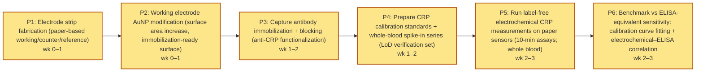

# Research Plan — paper-electrochemical-biosensor

> A paper-based electrochemical biosensor functionalized with anti-CRP antibodies will detect C-reactive protein in whole blood at concentrations below 0.5 mg/L within 10 minutes, matching laboratory ELISA sensitivity without requiring sample preprocessing.

**Domain:** diagnostics • **Plan ID:** `bd5f02eb-28c5-4e27-969d-bda3bed2e4e9` • **Created:** 2026-04-26T03:16:16.189Z

## 1. Novelty Check

**Signal:** `similar_work_exists`

**Prior-art references:**
- [Paper-based biosensors for C-reactive protein detection. (A)...](https://www.researchgate.net/figure/Paper-based-biosensors-for-C-reactive-protein-detection-A-Paper-based-electrochemical_fig5_355761299) *(ResearchGate)*
- [An optimised electrochemical biosensor for the label-free detection ...](https://pubmed.ncbi.nlm.nih.gov/22809521/) *(PubMed)*
- [A colorimetric paper-based immunosensor for high-sensitivity C-reactive protein (hs-CRP) detection - Analytical Methods (RSC Publishing)](https://pubs.rsc.org/en/content/articlelanding/2026/ay/d5ay01911g) *(RSC Publishing)*

## 2. Overview

**Primary goal.** Demonstrate that a paper-based electrochemical immunosensor functionalized with anti-CRP antibodies can quantify C-reactive protein (CRP) directly in whole blood with a limit of detection (LOD) <0.5 mg/L and a total sample-to-answer time ≤10 minutes, while achieving analytical sensitivity comparable to laboratory ELISA without any sample preprocessing (no centrifugation, dilution, or filtration).

**Validation approach.** Build and test a paper-based electrochemical CRP immunosensor using antibody functionalization on a paper-supported electrode (AuNP-modified working electrode as commonly used in paper electrochemical CRP formats) and quantify CRP via electrochemical readout (impedance and/or amperometric current). Validate performance through:

- **(1)** analytical characterization in buffer using CRP calibrators spanning at least 0.05–10 mg/L to confirm sub-0.5 mg/L detection.
- **(2)** matrix validation in anticoagulated whole blood (EDTA blood) by spiking recombinant/standard CRP into CRP-depleted or low-CRP donor blood to construct a whole-blood calibration curve and determine LOD, LOQ, and assay time.
- **(3)** method comparison using matched aliquots measured by a laboratory reference immunoassay (ELISA) to assess correlation and bias across the clinically relevant low range (hs-CRP region, including <0.5 mg/L). Include specificity/interference testing (high albumin, hemoglobin, lipids, rheumatoid factor where feasible) and evaluate sensor-to-sensor reproducibility (≥3 fabrication batches; ≥5 sensors per batch). Use a label-free impedimetric approach as a baseline comparator given prior evidence of sensitive CRP impedimetric detection in serum/blood matrices, and benchmark against published paper-based CRP device concepts for feasibility and design choices. Sources: paper-based electrochemical CRP detection concepts ([researchgate.net](https://www.researchgate.net/figure/Paper-based-biosensors-for-C-reactive-protein-detection-A-Paper-based-electrochemical_fig5_355761299)); label-free impedimetric CRP detection performance expectations ([pubmed.ncbi.nlm.nih.gov](https://pubmed.ncbi.nlm.nih.gov/22809521/)); hs-CRP paper-based immunosensor benchmarking context ([pubs.rsc.org](https://pubs.rsc.org/en/content/articlelanding/2026/ay/d5ay01911g)).

**Success criteria:**
- Whole-blood LOD (3σ/slope) for CRP is <0.5 mg/L, with LOQ (10σ/slope) ≤0.5 mg/L, determined from ≥3 independent calibration runs in whole blood.
- Total time from whole-blood application to reported concentration is ≤10 minutes (including incubation/wash steps if any), demonstrated on-bench with a stopwatch across ≥10 tests.
- Agreement with reference ELISA on matched samples shows correlation R ≥0.90 and mean bias within ±20% over 0.1–10 mg/L CRP, with particular emphasis on ≤1 mg/L range.
- Precision in whole blood: intra-assay CV ≤15% at 0.5 mg/L and 2 mg/L (n≥5 per level), and inter-batch CV ≤20% across ≥3 fabrication batches.
- Specificity: signal change for 0.5 mg/L CRP is at least 3× the signal change from blank whole blood and at least 3× the change from key non-specific protein challenges at physiologic concentrations (albumin), under the same assay conditions.
- No sample preprocessing is used (no centrifugation, plasma separation membranes, dilution, or chemical lysis); only direct application of anticoagulated whole blood to the paper device is permitted.

## 3. Protocol

### Step 1. Fabricate paper-based electrochemical electrode strip (working/counter/reference)  *(2 h)*

Cut cellulose paper (Whatman Grade 1) into 5–10 mm wide strips. Define hydrophobic barriers (wax printing or wax pen) to create a sample inlet zone and an electrode zone; bake at 120°C for 2 minutes to melt wax through the paper. Screen-print carbon ink to form working and counter electrodes; print Ag/AgCl ink as reference electrode (typical working electrode area 3–10 mm²). Cure printed inks per manufacturer guidance (commonly 60°C for 30–60 min) and store dry in a desiccator until functionalization.

Citations: [Paper-based electrochemical CRP biosensor format and paper device concept](https://www.researchgate.net/figure/Paper-based-biosensors-for-C-reactive-protein-detection-A-Paper-based-electrochemical_fig5_355761299)

### Step 2. Modify working electrode with AuNP layer to increase surface area and enable antibody immobilization  *(1 h)*

Prepare AuNP modification for the working electrode (either drop-cast commercial citrate-AuNPs or electrodeposit Au). For drop-cast: pipette 2–5 µL of AuNP suspension onto the working electrode and dry 30 minutes at room temperature. Rinse gently with PBS (10 mM phosphate, 137 mM NaCl, 2.7 mM KCl, pH 7.4) and dry 10 minutes. Optionally repeat once to increase coverage. Inspect visually for uniform coating and record batch ID for traceability.

Citations: [AuNP-modified electrodes used in paper-based electrochemical CRP biosensors](https://www.researchgate.net/figure/Paper-based-biosensors-for-C-reactive-protein-detection-A-Paper-based-electrochemical_fig5_355761299)

### Step 3. Immobilize anti-CRP capture antibody and block non-specific binding sites  *(2 h)*

Functionalize the AuNP-coated working electrode with capture antibody. Spot 2–3 µL of anti-CRP antibody at 50 µg/mL in PBS onto the working electrode area; incubate 60 minutes in a humid chamber at room temperature. Rinse with PBS-T (PBS + 0.05% Tween-20) 3× (10–20 µL each) to remove unbound antibody. Block with 1% (w/v) BSA in PBS (5–10 µL) for 30 minutes at room temperature; rinse 3× with PBS, then dry 15 minutes. Store devices at 4°C with desiccant (same-day use recommended for initial validation).

Citations: [Label-free electrochemical immunoassay workflow: antibody immobilization and blocking concepts](https://pmc.ncbi.nlm.nih.gov/articles/PMC6022967/)

### Step 4. Prepare CRP calibration standards and whole-blood samples (spike-in series for LoD verification)  *(1.50 h)*

Prepare CRP standards spanning below and above the target threshold, using recombinant human CRP in PBS or serum matrix: 0 (blank), 0.1, 0.25, 0.5, 1, 5 mg/L. For whole blood evaluation, spike CRP into fresh anticoagulated whole blood (EDTA) to the same nominal concentrations; gently invert 10× to mix. Run n=5 replicates per concentration to estimate LoD and time-to-result. Include selectivity controls (BSA at high concentration) to assess non-specific signal contributions.

Citations: [Example electrochemical biosensor calibration/ELISA correlation and selectivity testing context](https://www.researchgate.net/figure/Correlating-electrochemical-biosensor-and-ELISA-concentrations-R-2-099_fig7_349251368) · [Electrochemical immunoassay calibration/controls context](https://pmc.ncbi.nlm.nih.gov/articles/PMC6022967/)

### Step 5. Run 10-minute label-free electrochemical CRP measurement on paper sensor (whole blood)  *(0.50 h)*

Connect the paper sensor to a portable potentiostat. Add whole blood sample (10–20 µL) to the inlet zone and allow capillary flow to wet the electrode zone (target <1 minute). Start electrochemical readout immediately after wetting: use an impedance-based or voltammetric label-free immunoassay read compatible with the device (EIS in the presence of a redox probe such as 5 mM ferri/ferrocyanide in PBS; if using redox probe, add 10 µL probe after blood wetting and brief rinse step). Record signal at t=10 minutes. Define positive detection as signal exceeding blank mean + 3σ and verify performance at 0.25 and 0.5 mg/L. Cleanly dispose biohazard materials per BSL2 practices.

Citations: [Label-free electrochemical immunoassay measurement approach and analysis principles](https://pmc.ncbi.nlm.nih.gov/articles/PMC6022967/) · [Paper-based electrochemical CRP sensor workflow enabling rapid readout](https://www.researchgate.net/figure/Paper-based-biosensors-for-C-reactive-protein-detection-A-Paper-based-electrochemical_fig5_355761299)

### Step 6. Benchmark against ELISA-equivalent sensitivity via calibration curve fitting and electrochemical–ELISA correlation  *(2 h)*

Fit a calibration curve (4-parameter logistic or linear over low range) using measured electrochemical signal vs CRP concentration. Calculate LoD from blank + 3σ and confirm LoQ (blank + 10σ). For method comparison, plot electrochemical-derived concentrations vs ELISA concentrations (same samples; n≥20 across range) and compute R². Confirm whether the sensor meets the hypothesis criteria: detection below 0.5 mg/L within 10 minutes and correlation consistent with ELISA measurements.

Citations: [Correlation analysis concept (electrochemical vs ELISA) and reporting approach](https://www.researchgate.net/figure/Correlating-electrochemical-biosensor-and-ELISA-concentrations-R-2-099_fig7_349251368) · [Electrochemical immunoassay performance metrics and interpretation context](https://pmc.ncbi.nlm.nih.gov/articles/PMC6022967/)

## 4. Materials

| # | Reagent | Supplier | Catalog | Qty | Unit $ | Total $ |
|---|---|---|---|---|---:|---:|
| 1 | Label-Free Electrochemical Immunoassay for C-Reactive Protein (reference protocol/article access) | PubMed Central (NCBI) | [PMC6022967](https://pmc.ncbi.nlm.nih.gov/articles/PMC6022967/) | 1 | 0 | 0 |

**Materials total:** $0

## 5. Budget

| Category | Description | Cost (USD) | Citations |
|---|---|---:|---|
| reagents | Anti-human C-reactive protein (CRP) capture antibody (polyclonal rabbit anti-CRP), 1 vial (~100–200 µg) for electrode functionalization; sufficient for multiple optimization runs. | 199 | [sigmaaldrich.com](https://www.sigmaaldrich.com/US/en/search/c-reactive-protein-antibody?focus=products&page=1&perpage=30&sort=relevance&term=c-reactive%20protein%20antibody&type=product) |
| reagents | Recombinant human CRP antigen standard (for calibration curve and spike recovery), 1 vial. | 189 | [rndsystems.com](https://www.rndsystems.com/search?keywords=C-reactive%20protein%20recombinant%20human) |
| reagents | BSA (bovine serum albumin) and blocking reagents (casein/BSA) for surface passivation and assay buffers; includes PBS/Tween components for ~3 weeks of work. | 75 | [thermofisher.com](https://www.thermofisher.com/us/en/home/search.html?query=BSA%20fraction%20V) |
| reagents | Electrode surface chemistry reagents for immunoassay construction (EDC/NHS coupling kit, ethanolamine quench; includes small-molecule reagents for multiple coupling attempts). | 120 | [thermofisher.com](https://www.thermofisher.com/us/en/home/search.html?query=EDC%20NHS%20crosslinking%20kit) |
| consumables | Screen-printed electrodes (SPEs) (carbon/gold working electrode variants) for assay prototyping: 50-pack to cover optimization (n≈30–40 used, remainder as spares/QC). | 300 | [dropsens.com](https://www.dropsens.com/en/screen_printed_electrodes_pag.html) |
| consumables | Micropipette tips (filtered), microcentrifuge tubes, reservoirs, gloves, Parafilm; sufficient for 3-week bench work (electrode functionalization, calibrations, replicates). | 150 | [fishersci.com](https://www.fishersci.com/us/en/search.html?search=pipette%20tips%20filtered) |
| equipment | Potentiostat access fee / shared instrumentation recharge for electrochemical measurements (3 weeks; includes EIS/DPV capability and basic electrode connector accessories). | 500 | [pineinst.com](https://www.pineinst.com/potentiostats/) |
| labor | Scientist labor: ~60 hours across 6 phases (electrode prep, immobilization optimization, calibration, matrix testing, data analysis, reporting) at a typical academic loaded rate ~$75/hour. | 4500 | [bls.gov](https://www.bls.gov/oes/current/oes192041.htm) |
| overhead | Overhead/F&A at ~15% applied to direct costs (materials, equipment, labor) for institutional facilities and administrative support. | 904.95 | [grants.nih.gov](https://grants.nih.gov/grants/policy/nihgps/html5/section_7/7.4_reimbursement_of_facilities_and_administrative_costs.htm) |
| labor | Personnel | 4500 | — |
| overhead | Indirect costs | 904.95 | — |
| **total** | | **6937.95** | |

## 6. Timeline

**Total duration:** 3 weeks • **Critical path:** P1 → P2 → P3 → P4 → P5 → P6 • **Slack:** 0 wk

| ID | Phase | Start (wk) | Duration (wk) | Depends on |
|---|---|---:|---:|---|
| P1 | Electrode strip fabrication (paper-based working/counter/reference) | 0 | 1 | — |
| P2 | Working electrode AuNP modification (surface area increase, immobilization-ready surface) | 0 | 1 | P1 |
| P3 | Capture antibody immobilization + blocking (anti-CRP functionalization) | 1 | 1 | P2 |
| P4 | Prepare CRP calibration standards + whole-blood spike-in series (LoD verification set) | 1 | 1 | P3 |
| P5 | Run label-free electrochemical CRP measurements on paper sensors (10-min assays; whole blood) | 2 | 1 | P4 |
| P6 | Benchmark vs ELISA-equivalent sensitivity: calibration curve fitting + electrochemical–ELISA correlation | 2 | 1 | P5 |

## 7. Validation

**Metrics:**

| Name | Threshold | Method |
|---|---|---|
| Analytical limit of detection (LoD) for CRP in whole blood | LoD (blank mean + 3*SD, converted via calibration) ≤ 0.5 mg/L; verified with ≥20 independent blank whole-blood replicates (CRP-depleted or immunodepleted) and ≥5 low-level replicates at 0.25 and 0.5 mg/L | Run chronoamperometry (or DPV if used for final assay) on paper-based electrodes functionalized with anti-CRP. Generate calibration in whole blood (0, 0.1, 0.25, 0.5, 1, 2, 5 mg/L CRP) using spiked samples; fit 4-parameter logistic (4PL) or linear fit in working range; compute LoD as blank mean + 3SD mapped to concentration via inverse fit. |
| Time-to-result (TTR) | Median TTR ≤ 10 minutes from sample application to reported concentration; 90th percentile TTR ≤ 10 minutes (n ≥ 30 independent tests across ≥3 days) | Timestamp sample application, incubation, wash (if any), mediator/substrate addition (if any), and electrochemical readout completion; compute TTR distribution across operators and days using the finalized workflow. |
| Agreement with laboratory ELISA (method comparison) | Passing–Bablok slope between 0.90 and 1.10 and intercept within ±0.2 mg/L; Bland–Altman mean bias within ±0.2 mg/L for CRP range 0–10 mg/L; Pearson r ≥ 0.95 (n ≥ 60 paired whole-blood samples spanning 0–10 mg/L, including ≥20 samples ≤1 mg/L) | Measure CRP in the same donor whole-blood specimens with the paper sensor and a reference CRP ELISA (performed on matched plasma/serum per kit instructions). Use paired analysis with method-comparison regression (Passing–Bablok) and Bland–Altman; ensure sample range coverage by recruiting donors and/or preparing contrived samples by spiking recombinant CRP into CRP-low whole blood. |
| Precision (repeatability and intermediate precision) | Repeatability CV ≤ 10% at 0.5 mg/L and 2 mg/L (n=10 replicates each, same day, same operator); intermediate precision CV ≤ 15% at 0.5 mg/L and 2 mg/L (n=30 total per level across ≥3 days, ≥2 operators, ≥2 fabrication batches) | Run replicate measurements using finalized assay; compute %CV of reported concentration at each level; include batch IDs and operator IDs to quantify intermediate precision. |
| Diagnostic classification performance at 0.5 mg/L cutoff | Sensitivity ≥ 90% and specificity ≥ 90% for detecting CRP ≥ 0.5 mg/L versus <0.5 mg/L using ELISA as truth; two-sided 95% CI lower bounds ≥ 80% (n ≥ 100 paired samples with at least 40 positives ≥0.5 mg/L and 40 negatives <0.5 mg/L) | Classify each paired specimen by sensor result relative to 0.5 mg/L and compare to ELISA classification; compute sensitivity, specificity, and exact (Clopper–Pearson) 95% CIs; predefine handling of indeterminate/invalid sensor runs (count as failures; repeat once if sufficient sample). |

**Controls:**
- Negative control: CRP-depleted (immunodepleted) whole blood or verified CRP-low donor whole blood (<0.1 mg/L by ELISA), run at least 1 per 10 tests and at start/end of each day.
- Blank control: assay buffer (or saline) applied to sensor to quantify electrode/background current (n ≥ 5 per fabrication batch).
- Non-specific binding control: sensor functionalized with isotype-matched non-specific IgG instead of anti-CRP, tested with whole blood spiked to 2 mg/L CRP (n ≥ 5 per batch); signal must be ≤20% of specific anti-CRP signal at same concentration.
- Positive control: whole blood spiked with recombinant human CRP at 0.5 mg/L and 2 mg/L (n ≥ 2 per day and per batch) to verify calibration and assay function.
- Matrix interference control: paired measurements in

- **(i)** whole blood,.
- **(ii)** plasma/serum from same donor spiked to 0.5 and 2 mg/L; acceptance if recovery in whole blood is 80–120% of plasma/serum result (n ≥ 10 donors).
- Hemolysis/lipemia/icterus challenge controls: contrived samples with added hemoglobin (2 g/L), triglyceride emulsion (5 g/L), and bilirubin (0.2 g/L) each at 0.5 and 2 mg/L CRP; acceptance if bias ≤±15% versus unchallenged matched sample (n ≥ 5 per interferent).

**Statistics.** Design: two-phase validation. Phase 1 (analytical): LoD with ≥20 blank replicates and calibration across 6–8 concentrations; precision with n=10 replicates/level/day and n=30/level across days/operators/batches. Phase 2 (clinical/method comparison): n≥60 paired specimens for agreement analyses across 0–10 mg/L and n≥100 paired specimens for classification at 0.5 mg/L cutoff with ≥40 positives and ≥40 negatives. Primary endpoints:

- **(1)** LoD ≤0.5 mg/L.
- **(2)** TTR ≤10 min.
- **(3)** agreement with ELISA (Passing–Bablok slope 0.90–1.10, intercept ±0.2 mg/L, Bland–Altman bias ±0.2 mg/L). Statistical tests/models: LoD computed as blank mean + 3SD mapped through calibration; optionally confirm LoQ as lowest level with CV≤20% and bias ≤±20%. Precision as %CV with 95% CI via chi-square method. Method comparison: Passing–Bablok regression with 95% CI for slope/intercept; Bland–Altman with mean bias and 95% limits of agreement; Pearson r with 95% CI. Classification: sensitivity/specificity with exact (Clopper–Pearson) 95% CIs; McNemar’s test for paired classification discordance (two-sided alpha=0.05). Power: For sensitivity/specificity targets of 0.90 with minimum acceptable 0.80, requiring lower 95% CI ≥0.80 implies ≥40 positives and ≥40 negatives (exact binomial). For correlation r≥0.95 with n=60, 95% CI half-width is typically acceptable for agreement screening. Multiplicity and alpha: Two-sided alpha=0.05 for secondary inferential tests; primary success is based on meeting pre-specified numerical acceptance thresholds rather than p-values. Exclusions: predefine invalid runs (open circuit, visible flooding/shorting, out-of-range calibration) and report invalid rate; do not exclude based on measured concentration alone. Randomization/blinding: Randomize sample order; blind operator to ELISA results during sensor testing; ELISA staff blind to sensor results.

## 8. Provenance

Corrections applied: **0**

| Agent | Model | Latency (ms) | Tokens in/out |
|---|---|---:|---|
| novelty | gpt-5.2 | 3294 | 545 / 227 |
| overview | gpt-5.2 | 15029 | 520 / 802 |
| protocol | gpt-5.2 | 24421 | 601 / 1455 |
| materials | gpt-5.2 | 6747 | 621 / 160 |
| validation | gpt-5.2 | 30977 | 247 / 1645 |
| timeline | gpt-5.2 | 5998 | 404 / 443 |
| budget | gpt-5.2 | 23383 | 318 / 1480 |

---

_Generated by Hypothesis Hub — Person A engine + Person B retrieval._
