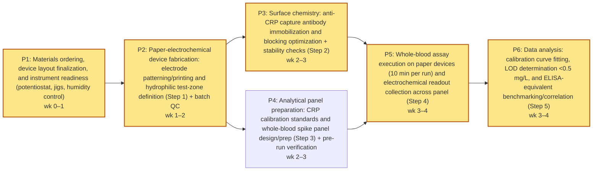

# Research Plan — paper-electrochemical-biosensor

> A paper-based electrochemical biosensor functionalized with anti-CRP antibodies will detect C-reactive protein in whole blood at concentrations below 0.5 mg/L within 10 minutes, matching laboratory ELISA sensitivity without requiring sample preprocessing.

**Domain:** diagnostics • **Plan ID:** `b0ed52d7-5db4-480d-8d92-8a6d36504820` • **Created:** 2026-04-26T03:19:56.484Z

## 1. Novelty Check

**Signal:** `similar_work_exists`

**Prior-art references:**
- [Paper-based biosensors for C-reactive protein detection. (A)...](https://www.researchgate.net/figure/Paper-based-biosensors-for-C-reactive-protein-detection-A-Paper-based-electrochemical_fig5_355761299) *(ResearchGate)*
- [An optimised electrochemical biosensor for the label-free detection ...](https://pubmed.ncbi.nlm.nih.gov/22809521/) *(PubMed)*
- [A colorimetric paper-based immunosensor for high-sensitivity C-reactive protein (hs-CRP) detection - Analytical Methods (RSC Publishing)](https://pubs.rsc.org/en/content/articlelanding/2026/ay/d5ay01911g) *(RSC Publishing)*

## 2. Overview

**Primary goal.** Demonstrate that a paper-based electrochemical immunosensor functionalized with anti-CRP antibodies can directly detect C-reactive protein (CRP) in untreated whole blood with a limit of detection (LoD) <0.5 mg/L and a total sample-to-answer time ≤10 minutes, and that its analytical sensitivity and quantitative agreement are comparable to a reference laboratory ELISA over the clinically relevant low range.

**Validation approach.** Build a paper-based electrochemical sensor test article (screen-printed 3-electrode format on paper or paper-hybrid) with a working electrode surface modified for antibody immobilization (AuNP-modified carbon or gold), then immobilize capture anti-CRP and block non-specific sites. Validate analytical performance in

- **(1)** buffer and.
- **(2)** CRP-spiked whole blood (fresh anticoagulated human blood) without preprocessing, using a rapid, label-free electrochemical readout (EIS and/or DPV) within a fixed 10-minute assay window (2 min sample application + 8 min incubation/read). Include negative controls (no CRP; non-target proteins; isotype/irrelevant antibody surface) and evaluate matrix effects by comparing whole blood vs serum/plasma where feasible. Quantify LoD/LoQ from calibration curves spanning at least 0.05–10 mg/L with emphasis around 0.1–1.0 mg/L. Assess precision (intra/inter-day), specificity, and lot-to-lot reproducibility across multiple paper devices. For method comparison, measure matched specimens (spiked whole blood aliquots and, where possible, paired clinical samples) by a commercial hs-CRP ELISA and compare to biosensor results via regression and Bland–Altman agreement. Ground design choices and expected performance against prior electrochemical CRP biosensor work (label-free impedimetric CRP detection in serum) and paper-based CRP sensor formats (including paper-electrochemical CRP concepts) as described in the related literature: [pubmed.ncbi.nlm.nih.gov](https://pubmed.ncbi.nlm.nih.gov/22809521/) and [researchgate.net](https://www.researchgate.net/figure/Paper-based-biosensors-for-C-reactive-protein-detection-A-Paper-based-electrochemical_fig5_355761299) ; additionally benchmark to paper-based hs-CRP immunosensor sensitivity targets discussed in the PAD literature: [pubs.rsc.org](https://pubs.rsc.org/en/content/articlelanding/2026/ay/d5ay01911g).

**Success criteria:**
- Total time from applying whole blood to reporting concentration is ≤10 minutes (timed, n≥10 runs across devices).
- Analytical LoD in untreated whole blood is <0.5 mg/L CRP (calculated as mean blank + 3σ, or equivalent; n≥6 blanks and n≥5 replicates per concentration near LoD).
- Quantitation is reliable at 0.5 mg/L in whole blood with CV ≤20% at 0.5 mg/L (n≥10 devices across ≥2 days).
- Calibration in whole blood shows monotonic response with R² ≥0.95 over at least 0.1–10 mg/L, and demonstrates resolvable discrimination between 0.25, 0.5, and 1.0 mg/L (p<0.05, n≥5 each).
- Specificity: response to non-target abundant blood proteins (human serum albumin, fibrinogen, IgG at physiological concentrations) produces <10% of the signal produced by 0.5 mg/L CRP under identical conditions (n≥3 per interferent).
- Matrix tolerance: signal shift between buffer and whole blood at 0.5 mg/L is ≤25% after applying the same assay timing and no preprocessing (n≥5 each), or is correctable by a whole-blood calibration without degrading LoD beyond 0.5 mg/L.
- Method agreement versus reference hs-CRP ELISA on matched samples meets both: correlation r ≥0.90 and Bland–Altman mean bias within ±0.1 mg/L over 0–1.0 mg/L (n≥20 matched samples/aliquots).
- Device reproducibility: lot-to-lot variation in signal at 0.5 mg/L is ≤15% (n≥10 devices from ≥2 fabrication lots).

## 3. Protocol

### Step 1. Fabricate paper-based electrochemical electrode area and define hydrophilic test zone  *(2 h)*

Cut cellulose paper (Whatman Grade 1) into 1.5 cm × 3 cm strips. Define a hydrophilic test zone (~6–8 mm diameter) with a wax barrier (wax printer or wax pen) and melt at 120°C for 2 minutes to form through-paper hydrophobic walls. Screen-print or stencil-print a 3-electrode layout (working, counter, reference) onto the test zone using carbon ink for working/counter and Ag/AgCl ink for reference; cure inks per manufacturer (typically 60°C for 30–60 min). Optionally drop-cast AuNP dispersion (10–20 µL) onto the working electrode and dry at room temperature for 30 minutes to increase surface area for immunoassay performance in paper-based CRP sensors.

Citations: [Paper-based electrochemical CRP sensor format and AuNP-modified electrodes](https://www.researchgate.net/figure/Paper-based-biosensors-for-C-reactive-protein-detection-A-Paper-based-electrochemical_fig5_355761299)

### Step 2. Functionalize working electrode with anti-CRP capture antibody and block nonspecific binding  *(1.80 h)*

Prepare immobilization solution: anti-CRP antibody at 50 µg/mL in PBS (pH 7.4). Pipette 5–10 µL onto the working electrode area only; incubate in a humid chamber for 60 minutes at room temperature. Rinse gently with PBS (3 × 50 µL) without flooding outside the wax barrier. Block with 1% (w/v) BSA in PBS, 10 µL, for 30 minutes at room temperature; rinse with PBS (3 × 50 µL). Air-dry the device 15 minutes before use. (If using a label-free electrochemical immunoassay readout, ensure the electrode surface and blocking conditions are compatible with the intended electrochemical measurement chemistry.)

Citations: [Label-free electrochemical immunoassay workflow for CRP and antibody-based capture principles](https://pmc.ncbi.nlm.nih.gov/articles/PMC6022967/)

### Step 3. Prepare CRP calibration standards and whole-blood spike panel spanning <0.5 mg/L target  *(1 h)*

Prepare CRP standards in PBS (or serum matrix if available) covering 0.05, 0.1, 0.25, 0.5, 1.0 mg/L (plus 0 mg/L blank). For whole blood, spike matched concentrations into fresh EDTA whole blood by adding concentrated CRP stock (minimize dilution; final dilution ≤5%). Mix by gentle inversion for 2 minutes and rest 5 minutes at room temperature. Prepare at least n=3 replicates per concentration. Include selectivity controls by spiking potential interferents (BSA, IgE) at physiologically relevant levels into the blank blood (or into a mid-level CRP sample) to assess nonspecific signal contributions.

Citations: [Detection range example and selectivity testing with BSA/IgE; correlation concept vs ELISA](https://www.researchgate.net/figure/Correlating-electrochemical-biosensor-and-ELISA-concentrations-R-2-099_fig7_349251368)

### Step 4. Run 10-minute whole-blood assay on paper-electrochemical device (no preprocessing) and record electrochemical signal  *(0.25 h)*

Place the paper sensor on a flat insulating support. Add 15–20 µL of whole blood (blank, standards, and test samples) directly onto the hydrophilic test zone to fully cover electrodes. Incubate for 8 minutes at room temperature in a humid box to prevent evaporation. Rinse the zone carefully with PBS (3 × 60 µL) while keeping flow contained by wax barriers. Immediately add 30–50 µL electrochemical measurement buffer compatible with the label-free immunoassay method (PBS with suitable redox mediator if required by the chosen readout), then perform electrochemical readout (differential pulse voltammetry or impedance spectroscopy) using a portable potentiostat. Record signal within a total sample-to-result time of 10 minutes (including incubation and readout).

Citations: [Label-free electrochemical immunoassay measurement approach applicable to CRP](https://pmc.ncbi.nlm.nih.gov/articles/PMC6022967/) · [Paper-based electrochemical CRP biosensor handling format](https://www.researchgate.net/figure/Paper-based-biosensors-for-C-reactive-protein-detection-A-Paper-based-electrochemical_fig5_355761299)

### Step 5. Determine LOD below 0.5 mg/L and benchmark against ELISA-equivalent performance via calibration and correlation  *(1 h)*

Construct calibration curve from blank and CRP spike panel (signal vs concentration). Calculate LOD as mean(blank) + 3×SD(blank) converted through the calibration curve; verify that LOD < 0.5 mg/L and that 0.5 mg/L is distinguishable from blank with n=3 replicates (two-sided t-test, α=0.05). For ELISA benchmarking, compare concentrations estimated from the biosensor calibration to the nominal spiked concentrations (and/or to ELISA measurements if available) by linear regression and report R² and slope to assess agreement.

Citations: [Example of correlating electrochemical biosensor concentrations with ELISA (R² reporting)](https://www.researchgate.net/figure/Correlating-electrochemical-biosensor-and-ELISA-concentrations-R-2-099_fig7_349251368)

## 4. Materials

| # | Reagent | Supplier | Catalog | Qty | Unit $ | Total $ |
|---|---|---|---|---|---:|---:|
| 1 | Label-Free Electrochemical Immunoassay for C-Reactive Protein (reference protocol/article access) | PubMed Central (NCBI) | [PMC6022967](https://pmc.ncbi.nlm.nih.gov/articles/PMC6022967/) | 1 | 0 | 0 |
| 2 | Correlating electrochemical biosensor and ELISA concentrations (figure/reference access) | ResearchGate | [RG-349251368-FIG7](https://www.researchgate.net/figure/Correlating-electrochemical-biosensor-and-ELISA-concentrations-R-2-099_fig7_349251368) | 1 | 0 | 0 |

**Materials total:** $0

## 5. Budget

| Category | Description | Cost (USD) | Citations |
|---|---|---:|---|
| reagents | Human C-Reactive Protein (CRP) standard protein, recombinant/serum-based, for calibration curve development and spike-recovery (assume 1 kit/lot sufficient for 4-week work; 1 mg class standard). | 299 | [sigmaaldrich.com](https://www.sigmaaldrich.com/US/en/search/c-reactive-protein-standard) |
| reagents | Anti-CRP capture antibody (polyclonal or monoclonal) for electrode functionalization (assume 1 vial). | 379 | [thermofisher.com](https://www.thermofisher.com/search/results?query=anti%20C-reactive%20protein%20antibody) |
| reagents | BSA (blocking reagent) and PBS tablets/buffer components for assay buffers (assume 1 bottle BSA + 1 pack PBS tablets). | 165 | [thermofisher.com](https://www.thermofisher.com/us/en/home/life-science/protein-biology/protein-biology-learning-center/protein-biology-resource-library/pierce-protein-methods/bsa-standards.html) |
| reagents | Electrode surface chemistry reagents for label-free electrochemical immunoassay (EDC/NHS coupling reagents + thiolated linker such as 11-mercaptoundecanoic acid for Au surfaces), sufficient for multiple runs. | 240 | [sigmaaldrich.com](https://www.sigmaaldrich.com/US/en/search/edc-nhs-coupling-reagents) |
| consumables | Screen-printed electrodes (SPEs) or disposable gold/carbon electrodes for electrochemical measurements (assume 2 packs to cover optimization + replicates). | 420 | [metrohm.com](https://www.metrohm.com/en_us/products/electrochemistry/screen-printed-electrodes.html) |
| consumables | Pipette tips, microcentrifuge tubes, reservoirs, Parafilm, nitrile gloves (bulk lab consumables for 4-week protocol execution). | 250 | [us.vwr.com](https://us.vwr.com/store/search?keyword=pipette%20tips) |
| equipment | Potentiostat/galvanostat access fee (institutional core recharge or rental allocation for 4 weeks; assumes instrument exists but recharge applies). | 600 | [gamry.com](https://www.gamry.com/products/potentiostats/) |
| other | Reference protocol/article access (label-free electrochemical immunoassay for CRP; correlating electrochemical biosensor and ELISA concentrations figure/reference): $0 (open access or institutional library subscription). | 0 | [scholar.google.com](https://scholar.google.com/scholar?q=label-free+electrochemical+immunoassay+C-reactive+protein) |
| labor | Scientist labor: 80 hours total across 4 weeks/6 phases (electrode prep, antibody immobilization, optimization, calibration, sample testing, data analysis) at loaded academic rate ~$75/hr. | 6000 | [hr.nih.gov](https://hr.nih.gov/working-nih/competencies/compensation/pay) |
| overhead | Overhead/F&A allocation at ~15% applied to direct costs (materials + equipment + labor). | 1258 | [grants.nih.gov](https://grants.nih.gov/grants/policy/nihgps/html5/section_7/7.4_reimbursement_of_facilities_and_administrative_costs.htm) |
| labor | Personnel | 6000 | — |
| overhead | Indirect costs | 1258 | — |
| **total** | | **9611** | |

## 6. Timeline

**Total duration:** 4 weeks • **Critical path:** P1 → P2 → P3 → P5 → P6 • **Slack:** 0 wk

| ID | Phase | Start (wk) | Duration (wk) | Depends on |
|---|---|---:|---:|---|
| P1 | Materials ordering, device layout finalization, and instrument readiness (potentiostat, jigs, humidity control) | 0 | 1 | — |
| P2 | Paper-electrochemical device fabrication: electrode patterning/printing and hydrophilic test-zone definition (Step 1) + batch QC | 1 | 1 | P1 |
| P3 | Surface chemistry: anti-CRP capture antibody immobilization and blocking optimization + stability checks (Step 2) | 2 | 1 | P2 |
| P4 | Analytical panel preparation: CRP calibration standards and whole-blood spike panel design/prep (Step 3) + pre-run verification | 2 | 1 | P2 |
| P5 | Whole-blood assay execution on paper devices (10 min per run) and electrochemical readout collection across panel (Step 4) | 3 | 1 | P3, P4 |
| P6 | Data analysis: calibration curve fitting, LOD determination <0.5 mg/L, and ELISA-equivalent benchmarking/correlation (Step 5) | 3 | 1 | P5 |

## 7. Validation

**Metrics:**

| Name | Threshold | Method |
|---|---|---|
| Analytical limit of detection (LoD) for CRP in whole blood | LoD (blank mean + 3 SD) ≤ 0.5 mg/L CRP in anticoagulated whole blood (EDTA), confirmed across ≥3 independent sensor lots | Prepare CRP-spiked EDTA whole blood at 0, 0.1, 0.25, 0.5, 1, 2, 5, 10 mg/L (recombinant human CRP). Run biosensor end-to-end (including sample addition and incubation) and record electrochemical signal (peak current/charge). Fit calibration (4-parameter logistic or linear in working range) and compute LoD as mean(blank) + 3×SD(blank) transformed into concentration via calibration. Use ≥20 blank replicates total (≥6 per lot) to estimate SD. |
| Time-to-result (TTR) to quantified CRP result | Median TTR ≤ 10.0 minutes from sample application to displayed concentration; 95th percentile TTR ≤ 12.0 minutes | For each run, timestamp sample application and timestamp when device outputs a concentration value. Collect TTR for all test runs used in method comparison (see below). Report median and 95th percentile. |
| Method agreement vs laboratory ELISA (whole blood-derived reference) | Correlation r ≥ 0.95 and Bland–Altman mean bias within ±15% with 95% limits of agreement within ±30% over 0.5–10 mg/L; additionally, ≥90% of samples within ±20% relative difference vs ELISA for CRP ≥ 1.0 mg/L | Collect paired samples: fingerstick or venous EDTA whole blood measured by biosensor; reference ELISA performed on matched plasma derived from the same EDTA whole blood (centrifuge per ELISA kit IFU) and reported in mg/L. Enroll at least n=60 unique donors/samples spanning CRP 0–10 mg/L with at least 20 samples in the 0–1 mg/L range. Compare biosensor concentration to ELISA concentration via Pearson correlation and Bland–Altman (log-transform if heteroscedastic). Compute percent difference for each sample; calculate proportion within ±20% for CRP ≥1 mg/L. |
| Clinical sensitivity/specificity at 0.5 mg/L decision threshold | Sensitivity ≥ 90% and specificity ≥ 90% for classifying CRP <0.5 vs ≥0.5 mg/L compared to ELISA | Using the paired dataset (n≥60), dichotomize by ELISA at 0.5 mg/L. Compute sensitivity, specificity, and 95% Wilson confidence intervals. Require at least 20 samples below 0.5 mg/L and 20 samples at/above 0.5 mg/L. |
| Precision (repeatability) in whole blood | Coefficient of variation (CV) ≤ 10% at 1.0 mg/L and ≤ 15% at 0.5 mg/L; across-run CV ≤ 15% at 1.0 mg/L | - **Repeatability.** For each of 3 concentrations (0.5, 1.0, 5.0 mg/L) in CRP-spiked EDTA whole blood, run n=10 replicates on the same day with the same operator and lot; compute CV%. - **Intermediate precision.** repeat 1.0 mg/L measurement across 3 days, 2 operators, and 3 lots (n=5 per day per lot; total n=45); compute overall CV% using random-effects model. |

**Controls:**
- Blank matrix control: EDTA whole blood with 0 mg/L added CRP (verified by ELISA) to establish baseline and LoD.
- Negative specificity control: sensor functionalized with isotype control antibody (same Ig class) instead of anti-CRP, tested at 0, 0.5, 5 mg/L CRP in whole blood to confirm minimal non-specific signal (target: signal at 5 mg/L ≤ 20% of specific sensor response).
- Positive control: CRP-spiked EDTA whole blood at 1.0 mg/L and 5.0 mg/L run each day of testing (acceptance: measured value within ±20% of nominal; otherwise invalidate day’s run).
- Matrix interference controls: hematocrit-adjusted whole blood (30%, 45%, 60% Hct) spiked at 1.0 mg/L CRP; acceptance: recovery 80–120% vs 45% Hct condition.
- Cross-reactivity controls: whole blood spiked with high physiological/pathological levels of potential interferents (human serum albumin 40 g/L, IgG 15 g/L, fibrinogen 4 g/L, rheumatoid factor 200 IU/mL, hemoglobin 2 g/L from hemolysate, bilirubin 20 mg/dL, triglycerides 1000 mg/dL) at 0 and 1.0 mg/L CRP; acceptance: change in apparent CRP ≤ ±0.2 mg/L at 0.5–1.0 mg/L range and ≤ ±10% at 5 mg/L range.
- Reference method control: ELISA run with kit calibrators and QC materials per manufacturer IFU; acceptance: QC within stated ranges and calibrator curve R² ≥ 0.99 (or manufacturer’s specified fit criteria).

**Statistics.** - **Design.** Method comparison with n=60 unique paired samples (biosensor vs ELISA), enriched to cover low range: ≥20 samples <0.5 mg/L, ≥20 samples 0.5–2 mg/L, ≥20 samples 2–10 mg/L.
- **Power.** For correlation, n=60 provides >90% power (two-sided alpha=0.05) to detect r≥0.95 vs null r=0.85. Primary endpoint tests:.

- **(1)** LoD estimate with 95% CI via nonparametric bootstrap (2000 resamples) using blank replicates; must meet ≤0.5 mg/L.
- **(2)** TTR summarized by median and 95th percentile with bootstrap CI; must meet thresholds.
  - **Agreement.** Pearson r with 95% CI; Bland–Altman bias and limits of agreement (log10 transform if proportional bias; back-transform to percent). Additionally compute Passing–Bablok regression with 95% CI for slope/intercept; acceptance: slope 0.85–1.15 and intercept within ±0.2 mg/L over 0.5–10 mg/L.
  - **Classification.** sensitivity/specificity at 0.5 mg/L with 95% Wilson CIs; must each be ≥90%.
  - **Precision.** CV% computed per CLSI-style approach; intermediate precision assessed with random-effects ANOVA (lot, day, operator as random factors) to estimate within- and between-factor variance; thresholds as specified.
  - **Multiplicity.** Treat LoD and TTR as co-primary; agreement and classification as key secondary; no multiplicity adjustment but require all co-primary to pass. Alpha=0.05 throughout; report exact p-values for regression slope/intercept departure from ideal (slope=1, intercept=0) using bootstrap CIs.

## 8. Provenance

Corrections applied: **0**

| Agent | Model | Latency (ms) | Tokens in/out |
|---|---|---:|---|
| novelty | gpt-5.2 | 3718 | 545 / 227 |
| overview | gpt-5.2 | 19112 | 520 / 930 |
| protocol | gpt-5.2 | 22868 | 601 / 1438 |
| materials | gpt-5.2 | 8385 | 528 / 295 |
| validation | gpt-5.2 | 28417 | 247 / 1623 |
| timeline | gpt-5.2 | 6359 | 393 / 503 |
| budget | gpt-5.2 | 22859 | 338 / 1489 |

---

_Generated by Hypothesis Hub — Person A engine + Person B retrieval._
