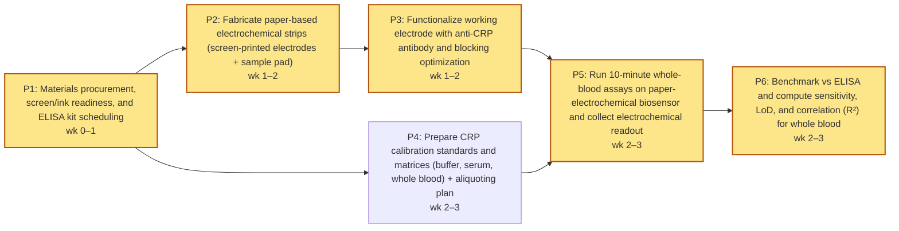

# Research Plan — paper-electrochemical-biosensor

> A paper-based electrochemical biosensor functionalized with anti-CRP antibodies will detect C-reactive protein in whole blood at concentrations below 0.5 mg/L within 10 minutes, matching laboratory ELISA sensitivity without requiring sample preprocessing.

**Domain:** diagnostics • **Plan ID:** `7a9e8ec9-94d5-4aef-8d37-b1a41f6c53a6` • **Created:** 2026-04-26T03:21:55.662Z

## 1. Novelty Check

**Signal:** `similar_work_exists`

**Prior-art references:**
- [Paper-based biosensors for C-reactive protein detection. (A)...](https://www.researchgate.net/figure/Paper-based-biosensors-for-C-reactive-protein-detection-A-Paper-based-electrochemical_fig5_355761299) *(ResearchGate)*
- [An optimised electrochemical biosensor for the label-free detection ...](https://pubmed.ncbi.nlm.nih.gov/22809521/) *(PubMed)*
- [A colorimetric paper-based immunosensor for high-sensitivity C-reactive protein (hs-CRP) detection - Analytical Methods (RSC Publishing)](https://pubs.rsc.org/en/content/articlelanding/2026/ay/d5ay01911g) *(RSC Publishing)*

## 2. Overview

**Primary goal.** Demonstrate that a paper-based electrochemical biosensor functionalized with anti-CRP antibodies can quantify C-reactive protein (CRP) directly in whole blood with a limit of detection <0.5 mg/L and a total sample-to-result time ≤10 minutes, and that its analytical sensitivity and accuracy are comparable to a laboratory ELISA benchmark without any sample preprocessing (no centrifugation, dilution, or filtration).

**Validation approach.** Analytically validate the paper-based electrochemical immunosensor using a stepwise comparison against an ELISA reference across clinically relevant CRP concentrations with a focus on hs-CRP range. Build and functionalize paper-based electrodes with antibody capture chemistry consistent with electrochemical CRP sensing approaches (label-free impedimetric formats) and paper-based CRP device architectures described in the related literature (paper-based electrochemical CRP sensing and impedimetric CRP detection) ([researchgate.net](https://www.researchgate.net/figure/Paper-based-biosensors-for-C-reactive-protein-detection-A-Paper-based-electrochemical_fig5_355761299), [pubmed.ncbi.nlm.nih.gov](https://pubmed.ncbi.nlm.nih.gov/22809521/), [pubs.rsc.org](https://pubs.rsc.org/en/content/articlelanding/2026/ay/d5ay01911g)). Use contrived whole-blood samples (commercial human whole blood, anticoagulated) spiked with recombinant human CRP at 0, 0.1, 0.25, 0.5, 1, 2, 5, and 10 mg/L. Measure each level in replicates (n≥5 per concentration per day) across ≥3 independent days to estimate LOD/LOQ, precision, and inter-day variability. Run matched aliquots of the same contrived samples on a standard lab ELISA kit (or clinical analyzer immunoassay if available) to establish reference concentrations and calculate bias. Evaluate matrix effects by testing at least two hematocrit levels (35% and 50%) and at least two donor sources. Record time-to-result from sample application to final electrochemical readout; enforce an operational workflow that fits within 10 minutes (including incubation/wicking and measurement). Assess specificity by challenging the sensor with potentially interfering proteins (albumin, fibrinogen, IgG) at physiological concentrations plus CRP-negative whole blood. Analyze performance via calibration curve (signal vs CRP), regression vs ELISA (Passing–Bablok or Deming), Bland–Altman bias, and receiver operating characteristics for a clinical decision threshold at 0.5 mg/L. Include negative controls (isotype antibody or no-antibody surface) and positive controls (known CRP standard) on each run.

**Success criteria:**
- Limit of detection (LOD) in whole blood <0.5 mg/L CRP, estimated from blank + 3σ (or equivalent) using ≥3 days of measurements and ≥5 replicates per level.
- Total sample-to-result time (from applying whole blood to obtaining quantitative readout) ≤10 minutes for ≥90% of tests under the defined workflow.
- Agreement with ELISA reference for contrived whole blood: correlation R ≥0.95 across 0–10 mg/L and mean absolute percent error (MAPE) ≤15% for 0.5–10 mg/L; for concentrations <0.5 mg/L, classification accuracy ≥90% for detecting CRP at/above 0.5 mg/L.
- Precision: coefficient of variation (CV) ≤15% at 0.5, 1, and 5 mg/L within-run; inter-day CV ≤20% at the same levels.
- Specificity: signal change in CRP-negative whole blood with added interferents (albumin, fibrinogen, IgG at physiological concentrations) is ≤10% of the signal observed at 0.5 mg/L CRP, and no-antibody/isotype control surfaces show ≤20% of the specific signal at 1 mg/L CRP.
- Matrix robustness: at hematocrit 35% vs 50% (and ≥2 donor sources), measured CRP at 0.5 and 2 mg/L differs by ≤20% from ELISA and maintains LOD <0.5 mg/L.

## 3. Protocol

### Step 1. Fabricate paper-based electrochemical strip with screen-printed electrodes and sample pad  *(2 h)*

Assemble a paper-based electrochemical sensor strip consisting of:

- **(i)** a cellulose sample pad (10–15 mm long),.
- **(ii)** a paper channel (wax-patterned) leading to.
- **(iii)** a screen-printed 3-electrode area (working/counter/reference). Use AuNP-modified working electrodes (drop-cast AuNP suspension onto the working electrode; allow to dry 30–60 min at room temperature) to support antibody immobilization and enhance signal. Ensure fluidic wicking brings whole blood from the sample pad to the electrode zone within <2 min (verify with colored dye). Store dry strips in a desiccator until use.

Citations: [Paper-based electrochemical CRP biosensor architecture (AuNP-modified electrodes; paper format)](https://www.researchgate.net/figure/Paper-based-biosensors-for-C-reactive-protein-detection-A-Paper-based-electrochemical_fig5_355761299)

### Step 2. Functionalize working electrode with anti-CRP antibody and block non-specific binding  *(3 h)*

Prepare antibody immobilization on the AuNP-modified working electrode using standard electrochemical immunoassay surface chemistry suitable for label-free detection. Suggested operational implementation:

- **(1)** activate AuNP surface with a thiolated carboxyl linker (11-mercaptoundecanoic acid, 1–5 mM in ethanol, 1 h), rinse with ethanol then PBS.
- **(2)** activate carboxyl groups with EDC/NHS (0.2 M EDC + 0.05 M NHS in MES buffer pH ~5.5, 30 min), rinse with PBS.
- **(3)** incubate anti-CRP antibody (50–100 µg/mL in PBS, 1 h at room temperature) on the working electrode.
- **(4)** block with 1% BSA in PBS for 30 min.
- **(5)** rinse with PBS and dry. Keep total reagent volumes low (3–10 µL per electrode) to match paper device format and maintain wicking. Maintain humidity during incubations to prevent drying artifacts.

Citations: [Label-free electrochemical immunoassay approach for CRP (antibody-based recognition; electrochemical readout)](https://pmc.ncbi.nlm.nih.gov/articles/PMC6022967/) · [Paper-based electrode modification and immunosensor concept](https://www.researchgate.net/figure/Paper-based-biosensors-for-C-reactive-protein-detection-A-Paper-based-electrochemical_fig5_355761299)

### Step 3. Prepare CRP calibration standards and matrices (buffer, serum, and whole blood)  *(1.50 h)*

Prepare CRP standards spanning below the hypothesis threshold and across the expected dynamic range. Use at minimum: 0 (blank), 0.05, 0.1, 0.2, 0.5, 1.0 mg/L CRP. Prepare in (a) PBS (for baseline), (b) CRP-depleted serum or commercial serum matrix, and (c) fresh anticoagulated whole blood (EDTA) spiked with CRP. Mix gently by inversion to avoid hemolysis. For each concentration and matrix, prepare n=3 replicates. Keep samples at 4°C and use within the same day. Record hematocrit if possible (as a covariate affecting electrochemical response).

Citations: [Electrochemical biosensor performance benchmarking versus ELISA concentrations](https://www.researchgate.net/figure/Correlating-electrochemical-biosensor-and-ELISA-concentrations-R-2-099_fig7_349251368) · [CRP electrochemical immunoassay measurement context and comparison framework](https://pmc.ncbi.nlm.nih.gov/articles/PMC6022967/)

### Step 4. Run 10-minute whole-blood assay on paper-electrochemical biosensor and collect electrochemical readout  *(2 h)*

For each strip:

- **(1)** apply 20–40 µL whole blood sample to the sample pad; allow wicking to the electrode zone (target <2 min).
- **(2)** Start timer at sample application.
- **(3)** Acquire label-free electrochemical signal at 10 minutes total assay time (including flow/incubation). Use a portable potentiostat; run EIS (0.1 Hz–100 kHz, 5–10 mV amplitude) or an equivalent label-free impedance/voltammetric method consistent with immunoassay readout.
- **(4)** Record raw spectra and extract a single metric (charge transfer resistance Rct at a defined equivalent circuit fit) as the analytical signal.
- **(5)** Between runs, use a fresh strip; do not reuse. Define acceptance criteria for assay time compliance: measurement completed by 10:00 ± 0:30 minutes.

Citations: [Label-free electrochemical immunoassay readout approach for CRP](https://pmc.ncbi.nlm.nih.gov/articles/PMC6022967/) · [Paper-based electrochemical CRP biosensor workflow (paper format and electrochemical measurement)](https://www.researchgate.net/figure/Paper-based-biosensors-for-C-reactive-protein-detection-A-Paper-based-electrochemical_fig5_355761299)

### Step 5. Benchmark against ELISA and compute sensitivity, LoD, and correlation (R²) for whole blood  *(6 h)*

In parallel, quantify CRP in the same spiked whole-blood samples using a reference ELISA per kit instructions (including any required dilution) to establish ground truth concentrations. For the electrochemical paper sensor, generate calibration curves in whole blood and compute:

- **(i)** limit of detection (LoD) using 3σ/slope from blank replicates (n≥3),.
- **(ii)** time-to-result compliance (≤10 min),.
- **(iii)** correlation between electrochemical-derived concentrations and ELISA (linear regression and R²). Evaluate whether concentrations <0.5 mg/L are distinguishable from blank with statistical significance (t-test, alpha 0.05) and whether regression supports “matching laboratory ELISA sensitivity” in the tested range.

Citations: [Example of correlating electrochemical biosensor and ELISA concentrations (R² benchmarking)](https://www.researchgate.net/figure/Correlating-electrochemical-biosensor-and-ELISA-concentrations-R-2-099_fig7_349251368) · [CRP electrochemical immunoassay performance assessment context](https://pmc.ncbi.nlm.nih.gov/articles/PMC6022967/)

## 4. Materials

| # | Reagent | Supplier | Catalog | Qty | Unit $ | Total $ |
|---|---|---|---|---|---:|---:|
| 1 | Paper-based electrochemical biosensor figure reference for CRP (AuNPs modified electrodes, Ca₂+ affinity binding concept) | ResearchGate | [RG-FIG5-355761299](https://www.researchgate.net/figure/Paper-based-biosensors-for-C-reactive-protein-detection-A-Paper-based-electrochemical_fig5_355761299) | 1 | 0 | 0 |
| 2 | Origami paper-based electrochemical sensing of CRP figure reference (device architecture concept) | ResearchGate | [RG-FIG4-352060533](https://www.researchgate.net/figure/A-Electrochemical-biosensors-a-origami-paper-based-sensing-of-CRP-reprinted-with_fig4_352060533) | 1 | 0 | 0 |
| 3 | Correlation plot reference for electrochemical biosensor vs ELISA concentrations (analysis benchmark concept) | ResearchGate | [RG-FIG7-349251368](https://www.researchgate.net/figure/Correlating-electrochemical-biosensor-and-ELISA-concentrations-R-2-099_fig7_349251368) | 1 | 0 | 0 |

**Materials total:** $0

## 5. Budget

| Category | Description | Cost (USD) | Citations |
|---|---|---:|---|
| reagents | Human C-reactive protein (CRP) antigen standard (for calibration curve; ~1 vial, research-grade) | 350 | [sigmaaldrich.com](https://www.sigmaaldrich.com/US/en/search/c-reactive-protein?focus=products) |
| reagents | Anti-human CRP capture antibody (for electrode functionalization; 1 mg scale typical) | 400 | [abcam.com](https://www.abcam.com/products/primary-antibodies/c-reactive-protein-antibody-ab32412.html) |
| reagents | Anti-human CRP detection antibody (secondary; for sandwich/confirmatory binding; 0.5–1 mg typical) | 350 | [thermofisher.com](https://www.thermofisher.com/search/results?query=c-reactive%20protein%20antibody&focus=Products) |
| reagents | BSA blocking reagent (100 g) + Tween-20 surfactant (100 mL) for assay buffers and blocking | 120 | [sigmaaldrich.com](https://www.sigmaaldrich.com/US/en/search/bovine-serum-albumin?focus=products) |
| reagents | Phosphate-buffered saline (PBS) tablets/pack + Tris/NaCl (buffer prep) for 3-week prototyping | 80 | [thermofisher.com](https://www.thermofisher.com/search/results?query=PBS%20tablets&focus=Products) |
| reagents | EDC/NHS coupling reagents (for carboxyl-to-amine conjugation on electrode surfaces; 1 set) | 180 | [thermofisher.com](https://www.thermofisher.com/search/results?query=EDC%20NHS&focus=Products) |
| reagents | Gold nanoparticle (AuNP) colloid (20–40 nm citrate AuNPs; ~100 mL) for electrode modification studies | 300 | [sigmaaldrich.com](https://www.sigmaaldrich.com/US/en/search/gold%20nanoparticles?focus=products) |
| reagents | Calcium chloride (CaCl2) for Ca₂+-dependent affinity binding concept testing (1 bottle) | 25 | [sigmaaldrich.com](https://www.sigmaaldrich.com/US/en/search/calcium%20chloride?focus=products) |
| reagents | Electrochemical redox probe: potassium ferri/ferrocyanide + KCl supporting electrolyte (for EIS/CV; 1 set) | 120 | [sigmaaldrich.com](https://www.sigmaaldrich.com/US/en/search/potassium%20ferricyanide?focus=products) |
| consumables | Paper microfluidics materials (Whatman Grade 1 filter paper sheets) + double-sided adhesive for origami layers | 120 | [cytivalifesciences.com](https://www.cytivalifesciences.com/en/us/shop/lab-filtration/filter-paper/qualitative-filter-papers/whatman-filter-paper-grade-1-p-05632) |
| consumables | Screen-printed electrodes (SPEs), gold or carbon (pack for prototyping; ~25–50 units) | 400 | [dropsens.com](https://www.dropsens.com/en/screen_printed_electrodes_pag.html) |
| consumables | Pipette tips (10/200/1000 µL) + microcentrifuge tubes (1.5–2 mL) + reservoirs for 3-week assay work | 200 | [fishersci.com](https://www.fishersci.com/us/en/browse/90098035/pipette-tips) |
| consumables | Disposable syringe filters (0.22 µm) + syringes for buffer filtration (1 box equivalent) | 100 | [fishersci.com](https://www.fishersci.com/us/en/browse/90136112/syringe-filters) |
| equipment | Potentiostat/galvanostat access (shared-instrument hourly recharge; assume 20 hours @ ~$25/hr) | 500 | [medicine.yale.edu](https://medicine.yale.edu/core/charges/) |
| labor | Scientist labor for 3-week, 6-phase effort (~60 hours total) at typical academic loaded rate ($75/hr) covering design, fabrication, assay runs, data analysis, and correlation benchmarking | 4500 | [bls.gov](https://www.bls.gov/oes/current/oes191042.htm) |
| overhead | Overhead/indirect costs at 15% of direct costs (materials + equipment + labor) | 774.75 | [grants.nih.gov](https://grants.nih.gov/grants/policy/nihgps/html5/section_7/7.4_reimbursement_of_facilities_and_administrative_costs.htm) |
| labor | Personnel | 4500 | — |
| overhead | Indirect costs | 774.75 | — |
| **total** | | **8519.75** | |

## 6. Timeline

**Total duration:** 3 weeks • **Critical path:** P1 → P2 → P3 → P5 → P6 • **Slack:** 0 wk

| ID | Phase | Start (wk) | Duration (wk) | Depends on |
|---|---|---:|---:|---|
| P1 | Materials procurement, screen/ink readiness, and ELISA kit scheduling | 0 | 1 | — |
| P2 | Fabricate paper-based electrochemical strips (screen-printed electrodes + sample pad) | 1 | 1 | P1 |
| P3 | Functionalize working electrode with anti-CRP antibody and blocking optimization | 1 | 1 | P2 |
| P4 | Prepare CRP calibration standards and matrices (buffer, serum, whole blood) + aliquoting plan | 2 | 1 | P1 |
| P5 | Run 10-minute whole-blood assays on paper-electrochemical biosensor and collect electrochemical readout | 2 | 1 | P3, P4 |
| P6 | Benchmark vs ELISA and compute sensitivity, LoD, and correlation (R²) for whole blood | 2 | 1 | P5 |

## 7. Validation

**Metrics:**

| Name | Threshold | Method |
|---|---|---|
| Limit of detection (LOD) in whole blood (CRP) | LOD <= 0.5 mg/L CRP (calculated as mean blank + 3*SD; verified with >=90% detection at 0.5 mg/L across replicates) | Prepare CRP-spiked human whole blood at 0, 0.1, 0.25, 0.5, 1, 5, 10 mg/L (n=10 independent replicates per concentration; at least 3 different donor blood lots total; anticoagulant EDTA). Run the paper electrochemical assay with anti-CRP functionalization per SOP. Record signal (peak current or charge at fixed potential window) within the intended 10-min workflow. Compute LOD from blank (0 mg/L) distribution; confirm empirical detection rate at 0.5 mg/L. |
| Time-to-result | >=95% of valid tests produce a quantitative CRP result in <=10.0 minutes from sample application | Time-stamp steps (sample addition start; end-of-read). Include n=60 total runs across concentrations (including at least 20 runs in the 0–1 mg/L range). Exclude only runs with pre-defined device/electrical failure criteria (documented open/short, unreadable trace). Report median and 95th percentile time-to-result. |
| Agreement to laboratory ELISA (sensitivity match/clinical equivalence proxy) | Correlation to ELISA: Pearson r >= 0.95 over 0.1–10 mg/L; and Bland-Altman bias within ±10% with 95% limits of agreement within ±25% (relative) vs ELISA | Measure the same whole-blood specimens (minimum n=50 distinct specimens spanning 0.1–10 mg/L, enriched near 0.5 mg/L) by the biosensor and a validated laboratory ELISA (plasma/serum prepared per ELISA IFU). For biosensor, run directly in whole blood without preprocessing; for ELISA, process per kit. Compare paired results using Pearson correlation and Bland-Altman analysis on log-transformed concentrations if heteroscedasticity is present. |
| Analytical precision (repeatability and intermediate precision) at low CRP | CV <= 15% at 0.5 mg/L (repeatability, within-day) and CV <= 20% at 0.5 mg/L (between-day, 3 days) | Use CRP-spiked whole blood at 0.5 mg/L and 5 mg/L. - **Repeatability.** n=10 replicates per level in one day with same operator/instrument. - **Intermediate precision.** n=5 replicates per level per day across 3 nonconsecutive days with at least 2 operators and 2 device lots. |
| Invalid rate / assay robustness in whole blood | Invalid test rate <= 5% (device or electrochemical readout failure) across n>=100 total tests | Track all runs including across donors (>=5 donors), hematocrit range targeted 35–55%. Define invalid as: no baseline stabilization within 120 s, out-of-range impedance check, or signal saturation/clip. Report invalid fraction with 95% binomial CI. |

**Controls:**
- Blank whole blood (0 mg/L added CRP) to establish background and LOD calculation (mean+3SD).
- Positive control: CRP-spiked whole blood at 0.5 mg/L and 5 mg/L included each run day (acceptance: within ±20% of nominal after calibration).
- Non-specific binding control: paper electrodes functionalized with isotype control antibody (same species/IgG subclass) tested against CRP-spiked blood (0.5–10 mg/L) to confirm signal is significantly lower than anti-CRP sensor (>=80% reduction at 5 mg/L).
- Matrix control: matched plasma/serum (processed) measured on the biosensor (if feasible) vs whole blood to assess matrix effect; acceptance: slope 0.9–1.1 in Deming regression over 0.5–10 mg/L.
- Interference controls in whole blood at 0.5 mg/L CRP: add potential interferents (hemoglobin 2 g/L, bilirubin 0.2 g/L, triglycerides 10 g/L, rheumatoid factor 200 IU/mL) and require recovery 80–120% vs no-interferent condition.
- Device-lot control: at least 3 manufacturing lots of paper sensors; require no significant lot effect (ANOVA p>0.05) and between-lot bias <=10% at 0.5 mg/L.

**Statistics.** Sample sizes:

- **(1)** LOD/curve: n=10 replicates per concentration x 7 concentrations = 70 tests, across >=3 donor lots (blocked design).
- **(2)** ELISA agreement: n=50 paired specimens spanning 0.1–10 mg/L.
- **(3)** precision: within-day n=10 per level; between-day n=5 per level per day x3 days.
- **(4)** robustness/invalid rate: n>=100 total runs across donors and lots. Significance level alpha=0.05 (two-sided).
  - **Power.** for agreement, n=50 provides >80% power to detect r>=0.95 vs null r=0.90 using Fisher z (two-sided alpha=0.05).
  - **Analyses.** LOD via blank mean+3SD and verification via empirical detection rate; calibration via weighted (1/x) linear or 4-parameter logistic as appropriate; accuracy/recovery computed as %recovery with 95% CI.
  - **Agreement.** Deming regression (accounts for error in both methods) and Bland-Altman (log transform if proportional bias); report bias and 95% LoA.
  - **Precision.** compute CV% and 95% CI (bootstrap). Lot/operator/day effects assessed with mixed-effects model (random effects: donor, day; fixed: concentration, lot, operator) and ANOVA on residuals; predefined acceptance thresholds above are primary success criteria. Invalid rate reported with exact (Clopper–Pearson) 95% CI; pass if upper CI bound <=8% and point estimate <=5%.

## 8. Provenance

Corrections applied: **0**

| Agent | Model | Latency (ms) | Tokens in/out |
|---|---|---:|---|
| novelty | gpt-5.2 | 2938 | 545 / 227 |
| overview | gpt-5.2 | 16252 | 520 / 910 |
| protocol | gpt-5.2 | 25892 | 601 / 1684 |
| materials | gpt-5.2 | 11452 | 569 / 460 |
| validation | gpt-5.2 | 27291 | 247 / 1407 |
| timeline | gpt-5.2 | 6113 | 383 / 453 |
| budget | gpt-5.2 | 32834 | 367 / 2219 |

---

_Generated by Hypothesis Hub — Person A engine + Person B retrieval._
